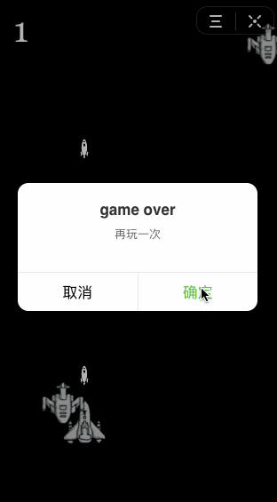

# codetyphon

一个今日头条小程序的canvas游戏引擎。

因为今日头条小程序的小游戏，只能用JavaScript写，因此神马pixi、phaser之类的框架都不能用了，当然可以移植但需要一些开发量。所以干脆，我就自己写了一个。可以加载图片资源，设置精灵，设置游戏状态及碰撞检测等。

## 示例代码

```
import {Res,Sprite,Render,Game,Width,Height} from './codetyphon.js';

Res.show_loading()
Res.add_img('player','./images/player.png');
Res.add_img('flyobj','./images/flyobj.png');
Res.add_img('bullet','./images/bullet.png');

Game.setup=function(){

  this.score=0;
  
  let x = Width/2-25;
  let y = Height-50;
  let player = new Sprite('player',Res.imgs['player'],x,y,50,65);//x,y,width,height
  player.time=0;
  //碰撞检测
  player.onCollide('obj',function(){
    Game.over();
  });

  player.run=function(){
    if(this.x<=0){
      this.x=0;
    }
    if(this.x>=Width-this.w){
      this.x=Width-this.h;
    }
    if(this.vx>this.x){
      this.x+=5;
    }
    if(this.vx<this.x){
      this.x-=5;
    }
    if(this.vy<this.y){
      this.y-=5;
    }
    if(this.vy>this.y){
      this.y+=5;
    }
    this.time+=1;
    if(this.time>50){
      let bullet = new Sprite('bullet',Res.imgs['bullet'],player.x+player.w/2-10,player.y,20,25);
      //碰撞检测
      bullet.run=function(){
        this.y-=5;
      }
      bullet.onCollide('obj',function(obj){
        obj.die=true;
        Game.score+=1;
      });
      Render.add(bullet);
      this.time=0;
    }
  }

  this.player=player;
  
  Render.add(player);

  tt.onTouchMove(res=>{
    this.player.vx=res.touches[0].clientX;
    this.player.vy=res.touches[0].clientY;
  });

  this.time=0;
  Render.background('#000000');
}

Game.looping=function(){
  
  this.time+=1;
  if(this.time>100){
    let obj = new Sprite('obj',Res.imgs['flyobj'],0,0,50,50);
    obj.randomX();
    obj.run=function(){
      this.y+=2;
      if(this.y>=Height){
        this.die=true;
      }
    }
    Render.add(obj);
    this.time=0;
  }
  
  Render.text(this.score,20,50,"#fff");
}
```

## 效果



